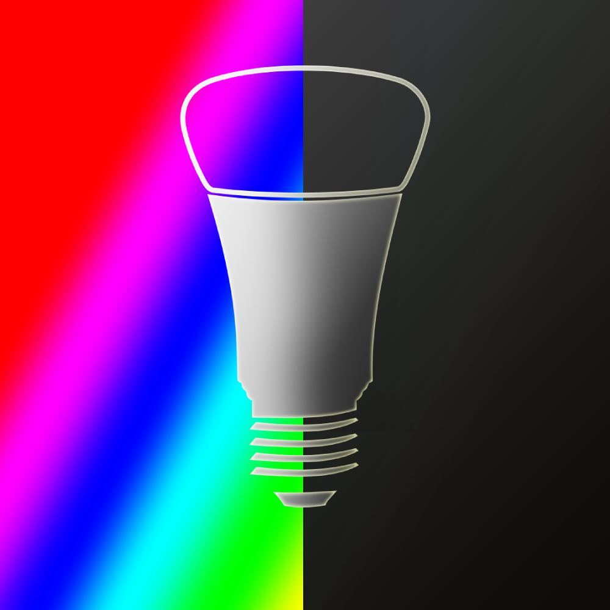

    

 

    
    <h3 align="center">homebridgeToggle</h3>
    
Gone? So are the lights.

This script interacts with the Homebridge API to toggle your lights based on whether your phone is at home or not. Your lights must be connected to Homebridge for this to function.

## How does it work?

The script operates by continuously checking a Dropbox file and switches the lights on or off based on your home status. Using iOS shortcuts, you can set up an automation to add a '0' to the text file when you leave home, and a '1' when you return home.

## How to use?

1. Create a text file on Dropbox and generate a publicly accessible link.
2. Configure iOS shortcuts to append `0` when your phone leaves your house and `1` when it arrives.
3. Install `python3` and the `requests`-module.
4. Clone the project repository to your local machine.
5. Define the required environment variables in `/etc/environment` and in the `config.py` file.
6. Add the script to a cronjob to ensure it executes on boot. You can do this using the `crontab -e` command.

**Note:** You will need to supply a list of unique light IDs. These can be found by running the script with the `--list` or `-L` flag.

## Environment Variables

* `HOMEBRIDGE_BASE_URL`: Your Homebridge server's base URL.
* `LOCATION_SYNC_FILE_URL`: The URL of the Dropbox file that the script will check.
* `HOMEBRIDGE_USERNAME`: Your Homebridge username.
* `HOMEBRIDGE_PASSWORD`: Your Homebridge password.